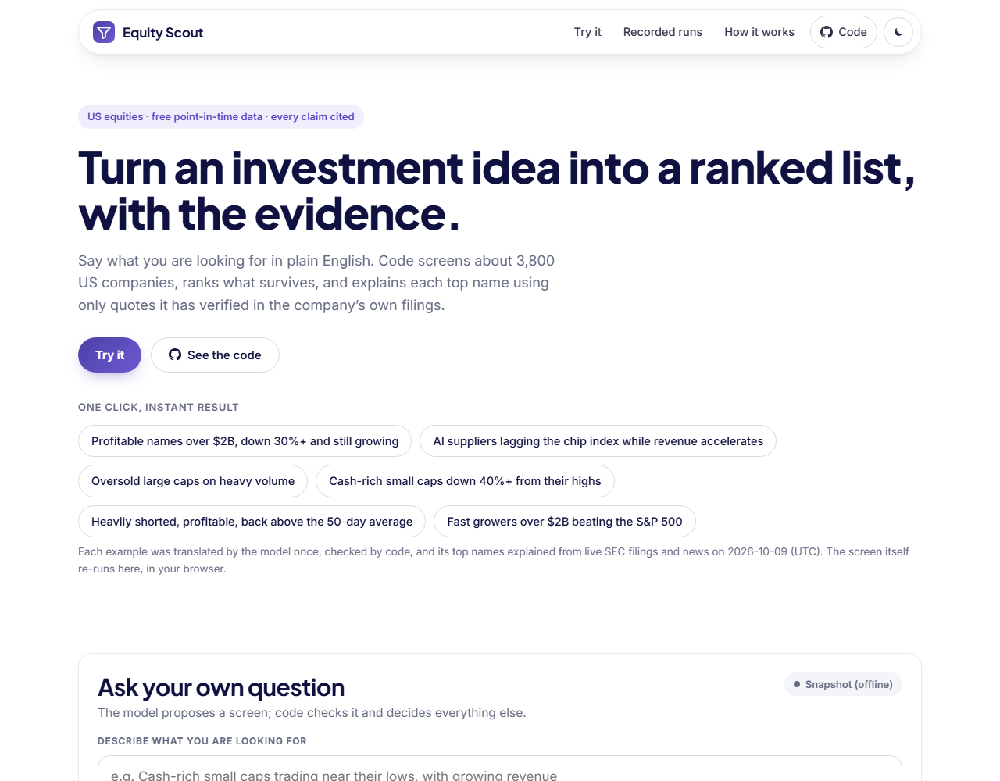
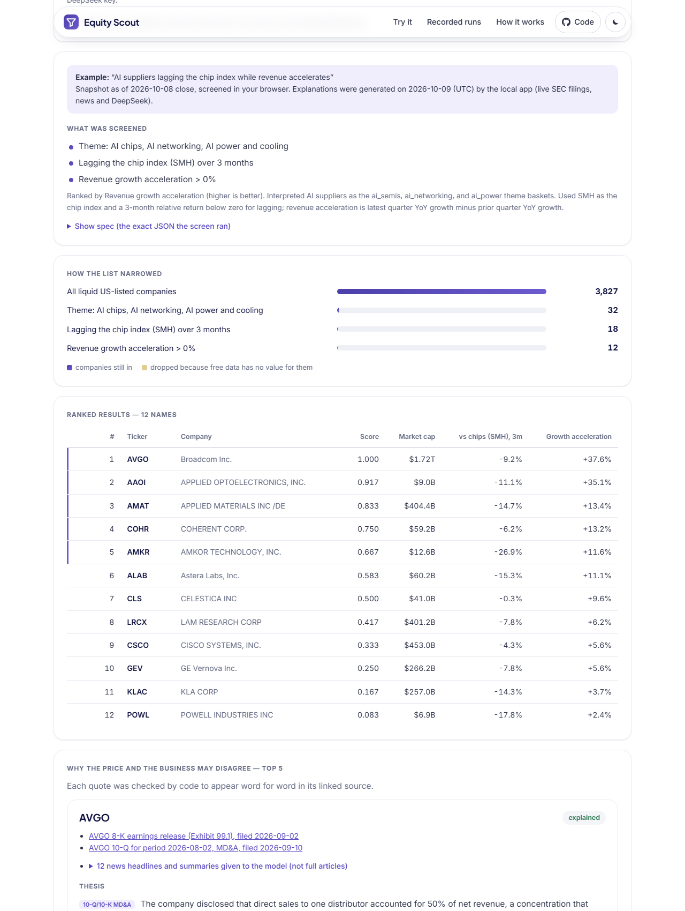
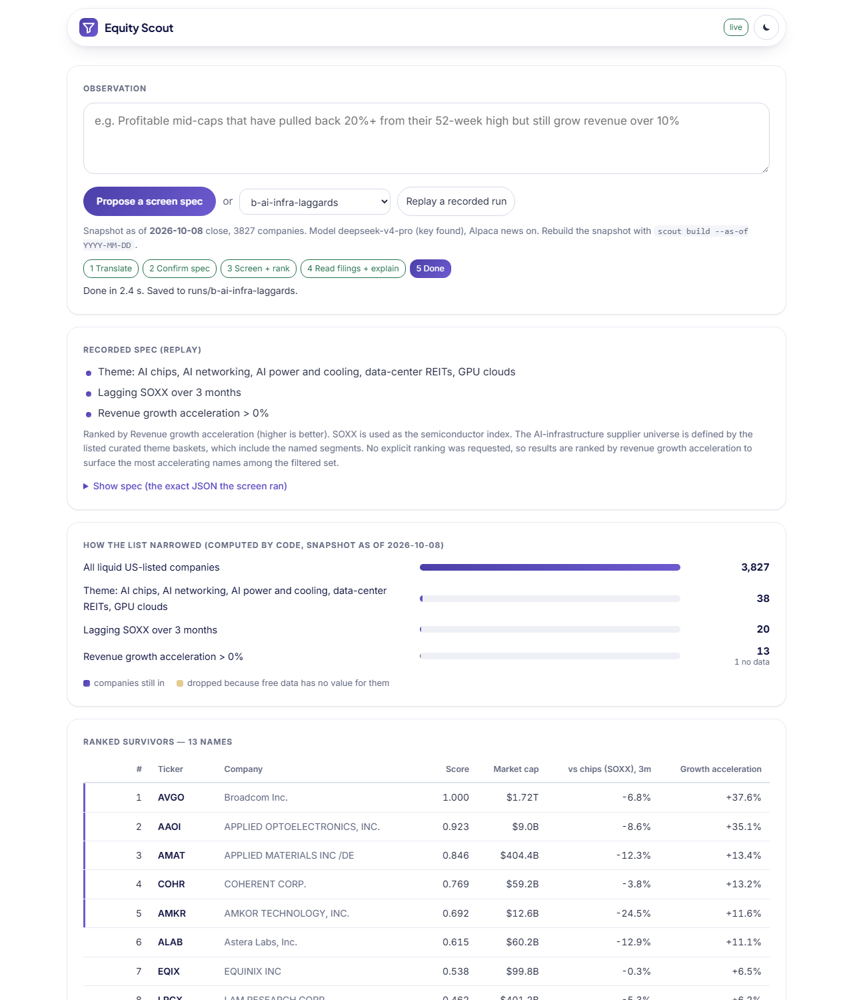

# equity-scout

Write an investment observation in plain English, for example *"profitable mid-caps that have pulled back 20%
from their highs but are still growing revenue over 10%"*. A language model translates it into a typed,
whitelisted screen spec. Code validates the spec, screens about 3,800 US-listed operating companies on
point-in-time data, ranks the survivors and computes every number. For the top names, the model reads the latest
earnings release, the 10-Q/10-K MD&A and recent news headlines, then explains why the stock and the fundamentals
might disagree. Code deletes any claim whose quote does not appear verbatim in its source.



## Try it

**In the browser, nothing to install:** open the site
([henryzhangpku.github.io/equity-scout](https://henryzhangpku.github.io/equity-scout/), or `docs/index.html` from disk).

* **One-click examples** sit just under the headline: plain-English ideas a trader would write ("Oversold large
  caps on heavy volume", "AI suppliers lagging the chip index while revenue accelerates", and others). Each was
  translated by the model once and checked by code. Its spec, prompt and response are in `llm_cache/` and the full
  run is in `runs/chip-*`. Clicking an example re-runs the screen in the page on the 2026-10-08 snapshot and shows
  the cited explanations the local pipeline wrote for its top names, labelled with the run date. No key is needed.
* **Ask your own question.** When the hosted API is reachable (its URL is set in `docs/config.js`), the box sends
  the question to it. The model proposes a screen, you see it in plain English and confirm, code runs it, and
  explanations arrive name by name. The status pill reads *Live* or *Snapshot (offline)*. If the API is down,
  capped or not configured, the page says so and the examples keep working.
* **Advanced** (collapsed): a spec editor limited to whitelisted fields, plus bring-your-own-key translation.
  DeepSeek allows browser CORS; the key stays in memory and goes only to api.deepseek.com.
* Everything a visitor reads is in plain English: "Down at least 20% from 52-week high", "Free cash flow, last 12
  months > $0". Raw field names appear only under *Show spec*.
* The screen, funnel and ranking in the page come from `docs/scout-core.js`, a line-by-line port of the Python code.
  A parity test runs every recorded spec, including each example, through both implementations and requires
  identical funnels and rankings. The snapshot is 5.2 MB raw and about 2.1 MB gzipped, and loads on first use.
* Light and dark themes follow the system setting. A toggle in the nav overrides it, and the choice is remembered
  when browser storage works.



**Locally, for live demos:** `uv run scout serve` opens `http://127.0.0.1:8765/`. Type an observation and the model
proposes a spec. After you confirm, the full pipeline runs on the latest snapshot plus live EDGAR filings and Alpaca
news, and cited explanations stream in one name at a time.

* *Replay a recorded run* needs no network.
* `--offline` answers only from recorded material.
* Picks go into the hash-chained ledger only when you click **Record**.



## The rule: the model proposes, deterministic code decides

| Step | Model | Code |
|---|---|---|
| Translate | fills a JSON spec from the observation | validates every key, field, operator, unit and threshold against a whitelist; refuses anything else with a reason; one correction round, then the run stops |
| Screen | nothing | applies the conditions in order and records, for each step, how many names entered, passed, failed and lacked data |
| Rank | nothing | weighted mean of percentile ranks; ties go to market cap, then ticker |
| Explain | writes claims, each with a quote and a document id | keeps a claim only if the quote is found verbatim in that document (only whitespace, curly quotes and dashes are normalised) and every number in the claim also appears in the quote; with fewer than two surviving thesis claims the verdict is *not enough evidence* |

Anything the schema cannot express (analyst downgrades, guidance, sentiment) goes in `unmapped` and is shown
as **not screened**. It is never silently dropped or approximated. Every prompt and response is stored in
`llm_cache/`, so the recorded runs replay offline with no API key.

## Architecture

```
observation ──LLM──▶ spec (JSON) ──validate──▶ screen ──▶ funnel + ranked table ──▶ top N
                                                  ▲                                    │
             feature snapshot (point-in-time) ────┘          EDGAR 8-K ex.99.1, MD&A, news headlines
   Alpaca bars ─ indicators                                              │
   SEC companyfacts ─ TTM / growth / FCF / EV                       LLM writes claims
   SEC submissions ─ SIC, filing list                                    │
   FINRA short interest                                       citation validator ──▶ report
```

Every data layer sits behind a small interface in `src/scout/data/base.py`, so a licensed source can replace the
free one without touching the screen, the ranking or the validator.

| Layer | This demo (free) | Institutional equivalent | What the free version lacks |
|---|---|---|---|
| Universe + prices | Alpaca assets + daily SIP bars, split and dividend adjusted (`data/alpaca.py`) | Bloomberg BQL / BQuant, LSEG, S&P Capital IQ | survivorship-free history, delisted names, intraday data |
| Fundamentals | SEC XBRL companyfacts, each fact gated by its `filed` date (`data/sec.py`, `fundamentals.py`) | BQL fundamentals, Capital IQ / Compustat point-in-time | IFRS filers, standardised line items, segments, consensus estimates and revisions |
| Classification | SEC SIC codes in named groups, plus a few curated theme baskets defined in code | GICS, BICS, TRBC, vendor theme baskets | real theme membership |
| Short interest | FINRA consolidated short interest, twice monthly (`data/finra.py`) | securities-lending feeds | float-based %, daily data, borrow cost |
| Documents | EDGAR 8-K Exhibit 99.1 and 10-Q / 10-K MD&A (`data/edgar_docs.py`) | document search on the same terminals | earnings-call transcripts (interface kept, `NoTranscripts`) |
| News | Alpaca news API (Benzinga): headline and summary only, cut at the as-of close (`data/news.py`) | Bloomberg / LSEG / Dow Jones news | full articles, broad sources |
| LLM | DeepSeek `deepseek-v4-pro` (Kimi as an alternative) through one OpenAI-compatible client (`llm.py`) | a frontier model inside the firm's controls | nothing structural |

### Point-in-time rules

* A fundamental fact is visible only on or after its `filed` date. When a period is restated, the restated value
  stays hidden until it is filed.
* Quarters are taken as reported or derived from year-to-date facts within a single XBRL concept (Q4 = FY − 9M).
  Cash-flow items are mostly reported year-to-date, so this derivation is what makes TTM free cash flow possible.
* If the latest quarter ended more than 220 days before the as-of date, the fundamentals are left missing. They are
  never carried forward.
* Short interest is visible 8 business days after its settlement date. News is visible only if it was published
  before 16:00 New York time on the as-of date.
* The SEC frames API was evaluated and not used for values. A frame returns the *latest-filed* number for each
  period and has no `filed` date, so a restatement would leak into the past (`data/sec.py` explains this).

## Recorded runs (real data as of 2026-10-08 close)

| Run | Funnel (names left after each step) | Top names |
|---|---|---|
| A: profitable mid-caps, 20%+ below the 52-week high, revenue growth > 10%, FCF positive, back above the 50-day | 3827 → 1902 → 1318 → 756 → 343 → 174 → 131 → **23** | VICR (not enough evidence), SITM, STRL, SANM, KLIC |
| B: AI-infrastructure suppliers lagging the semiconductor index (SOXX) over 3 months with accelerating revenue growth | 3827 → 38 → 20 → **13** | AVGO, AAOI, AMAT, COHR, AMKR |
| C: large caps with RSI < 35 on 1.5x volume, 50-day still above the 200-day, FCF positive, short interest < 5%; "no recent analyst downgrades" refused as unmapped | 3827 → 872 → 86 → 29 → 14 → 3 → **2** | BX, SBUX |

Each run folder in `runs/` holds `run.json` (spec, translation attempts, funnel, every ranked row, explanations,
data manifest with SHA-256 hashes), `report.md`, and `docs/`, which contains the exact document text the model
was shown, so each citation can be checked by hand.

The universe in run B comes from curated baskets (`THEMES` in `spec.py`). SIC codes cannot separate data-center
REITs from other REITs or find neoclouds at all, and with SIC alone the top of the list was micro-caps. The
baskets are a fixed list in code, open to review, and the model can only choose among them.

### One-click examples (same snapshot; explanations generated 2026-10-09 UTC)

| Example | Funnel | Top names |
|---|---|---|
| Profitable names over $2B, down 30%+ and still growing | 3,827 → 1,902 → 1,120 → 239 → 205 → 163 | CTVA, TTD, LQDA, Z, CSGP |
| AI suppliers lagging the chip index while revenue accelerates | 3,827 → 32 → 18 → 12 | AVGO, AAOI, AMAT, COHR, AMKR |
| Oversold large caps on heavy volume | 3,827 → 872 → 35 → 7 | EMA, ARGX, NLY, DOC, HRL |
| Cash-rich small caps down 40%+ from their highs | 3,827 → 3,060 → 1,158 → 389 → 111 → 31 | OPFI, COLL, YELP, TDOC, CRMD |
| Heavily shorted, profitable, back above the 50-day average | 3,827 → 1,633 → 28 → 6 | WOLF, KSS, CBRL, MNRO, SWKS |
| Fast growers over $2B beating the S&P 500 | 3,827 → 1,902 → 206 → 106 → 66 | BMNR, VAL, IBRX, MU, TARS |

## Forward tracking

Every live run appends its top names and entry closes to `runs/picks.jsonl`. The file is append-only and
hash-chained: each entry stores the SHA-256 of its own content and the hash of the entry before it, so editing or
deleting a past entry is detected. `scout track` checks the chain and marks every entry to market against SPY and
SMH using fresh Alpaca closes. The site shows the result under the label **"since run date; days of history, not
evidence"**. As of the recording date every entry has 0 trading days of history.

## Data limits

* Only US-GAAP quarterly filers have fundamentals. Foreign private issuers (IFRS, 20-F) and banks with
  non-standard revenue tags show up as *missing* in the funnel. About 1,100 of the 3,827 names have no current
  fundamentals.
* Market cap is the price times the latest cover-page share count. For multi-class issuers the count often covers
  one class only. When it is far below the weighted-average share count, the weighted average is used instead.
  Counts under 100,000 shares, and any market cap implying price/sales below 0.01, are rejected as data errors.
  The name is then *missing*, not mis-sized. Berkshire, for example, drops out of size filters instead of
  appearing as a $0.5B company.
* Prices come from Alpaca's current asset list, so delisted names are absent. That is survivorship bias, harmless
  for a screen as of today but wrong for a backtest.
* Short interest is a percentage of shares outstanding, not float (float is not in free data).
* No consensus estimates, revisions, ownership or borrow data. Those need a licensed source, and the spec
  refuses conditions on them.
* Any change to a prompt or to the schema text changes the request hash and invalidates the recordings. Re-record
  by running the observation again with a key set.

## Run it

```bash
uv sync
# offline: replay a recorded run (no keys, no network)
uv run scout replay runs/b-ai-infra-laggards

# live: needs DEEPSEEK_API_KEY, plus ALPACA_API_KEY / ALPACA_API_SECRET for news
uv run scout run "Profitable mid-caps ... back above the 50-day average." --top 5
uv run scout spec "..."          # translate only; prints the validated spec
uv run scout serve               # local web app (add --offline for recorded material only)
uv run scout track               # mark the pick ledger to market vs SPY and SMH
uv run scout site                # export runs, schema and the browser snapshot to docs/data/

# rebuild the feature snapshot for a new date (Alpaca + SEC + FINRA, about 30 min cold, cached afterwards)
uv run scout build --as-of 2026-10-08
```

`scout run` prints the spec and asks for confirmation before it screens (`--yes` skips the prompt). Keys are read
from the environment, and on Windows also from the per-user environment in the registry. They are never printed or
written to disk. Choose the model provider with `--provider deepseek|kimi`. The Kimi client is wired up but untested end to end:
the key used here belongs to a plan that the Kimi coding endpoint rejected (HTTP 403).

Dependencies: `numpy`, `pandas`, `requests`, plus `pytest` for development. HTML is parsed with the standard
library.


## Deploy (hosted API)

`scout serve` doubles as the live API behind the static site. With `SCOUT_HOSTED=1` it:

* binds `0.0.0.0:$PORT` and reads all configuration from the environment;
* limits CORS to the allowed origins;
* rate-limits each IP and caps the whole service per day;
* disables the ledger "record" action (the append-only ledger stays local and authoritative);
* keeps runs in a temp directory;
* never returns upstream errors or keys;
* logs one JSON line per action, with client IPs hashed.

| Variable | Default | Meaning |
|---|---|---|
| `PORT` | 8765 locally, 8080 in the image | port to bind (Railway sets it) |
| `SCOUT_HOSTED` | unset (`1` in the image) | hosted mode |
| `DEEPSEEK_API_KEY` | none | model for translation and explanations; without it the API reports `live: false` |
| `ALPACA_API_KEY`, `ALPACA_API_SECRET` | none | news headlines for explanations (optional; filings-only without them) |
| `SCOUT_SEC_CONTACT` | the author's address | contact in the SEC User-Agent (fair-access rule) |
| `SCOUT_ALLOWED_ORIGINS` | `https://henryzhangpku.github.io`, localhost, `null` | comma-separated CORS allowlist |
| `SCOUT_DAILY_RUN_CAP` | 40 | live runs per UTC day, whole service (translations get 3x) |
| `SCOUT_PER_IP_PER_HOUR` | 5 | live runs per IP per hour (translations get 3x) |
| `SCOUT_KILL` | unset | `1` refuses new translations and runs with a friendly message |
| `SCOUT_LOG_SALT` | random per process | salt for hashing client IPs in logs |
| `SCOUT_DATA_DIR` | `./data` | where feature snapshots live (a mounted volume if refreshed in place) |
| `SCOUT_LLM_CACHE` | `./llm_cache` | model response cache (identical requests are free) |
| `HOST` | `0.0.0.0` when hosted | bind address override |

Other fixed limits: observations up to 500 characters, at most 5 names explained per run, one concurrent run per IP,
60 s to read a request, 180 s per model call, jobs kept in memory for an hour.

API (JSON; CORS for allowed origins only):

* `GET /api/health`: snapshot date, `live`, `killed`, runs remaining.
* `POST /api/translate {observation}`: returns the validated spec, or the refusals.
* `POST /api/run {spec}`: returns the funnel, the ranked table and a job id.
* `GET /api/run/<job>`: explanations so far plus the names still pending.

**Build and start.** The repo has a `Dockerfile`, `railway.json` (Dockerfile builder, healthcheck on `/api/health`)
and a `Procfile`.

```bash
docker build -t equity-scout .
docker run -p 8080:8080 -e DEEPSEEK_API_KEY=... -e ALPACA_API_KEY=... -e ALPACA_API_SECRET=... equity-scout
# start command inside the image: scout serve --no-browser --port $PORT   (SCOUT_HOSTED=1 is set in the image)
```

The image ships the latest committed snapshot (`data/snapshots/`). To serve fresh data, either rebuild and commit a
snapshot (`uv run scout build --as-of today`, then redeploy), or mount a volume at `SCOUT_DATA_DIR` and run
`scout build --as-of today` against it on a schedule. The server picks up the newest snapshot on the next run. The
cold build takes about 30 minutes and needs the Alpaca keys. `--as-of today` resolves to the latest US session that
has closed.

Once deployed, put the service URL in `docs/config.js` (`window.SCOUT_API_BASE`) and redeploy Pages.

## Tests

`uv run pytest`: 106 tests, none skipped. The browser parity tests need Node.js on the PATH.

* indicators against hand-computed values (SMA, Wilder RSI step by step, EMA/MACD, momentum, volume ratio,
  drawdown, relative strength)
* point-in-time visibility, hidden restatements, YTD-derived quarters, TTM consecutiveness, staleness, share-count
  sanity rules
* schema validation and refusals: unknown fields, operators, industries and themes, percent-vs-decimal mistakes,
  and short-interest conditions when the source is unavailable
* the citation validator rejects paraphrased, invented, case-changed and too-short quotes, and numbers that are not in the quote
* funnel arithmetic on a hand-built universe, including missing data counts
* the pick ledger detects edits and deletions; mark-to-market arithmetic
* news cut at the as-of close, with full article text never used
* browser parity: the JS validator, screen and ranker under Node give the same funnels, rankings and
  refusal messages as Python, on the shipped browser snapshot and against the recorded runs
* `scout serve` endpoints, offline: status, translate from the recorded cache, refusals, a streamed run that
  reproduces run C, record-on-click (one ledger entry, chain intact), replay, path and job guards
* hosted mode: CORS allowlist, per-IP and daily caps, one run per IP, kill switch, input limits, disabled record/replay,
  generic upstream errors, hashed IPs in logs, and no key ever appearing in any response
* offline replay of every recorded run, including the six examples, with the network disabled, reproduces spec, funnel, ranking and
  explanations exactly

Research tool only: it places no orders and makes no recommendations.
